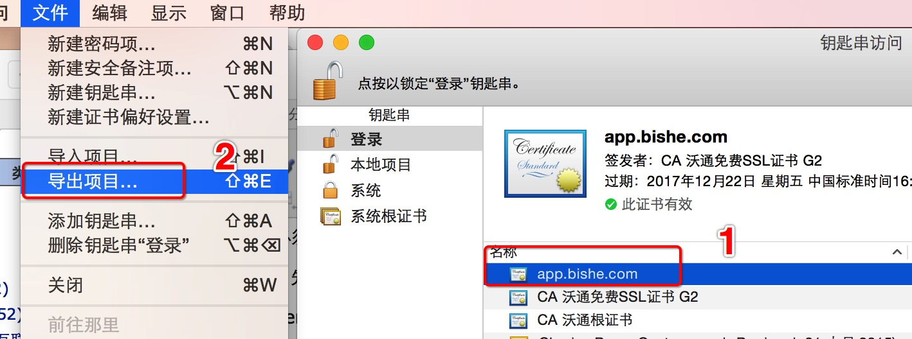
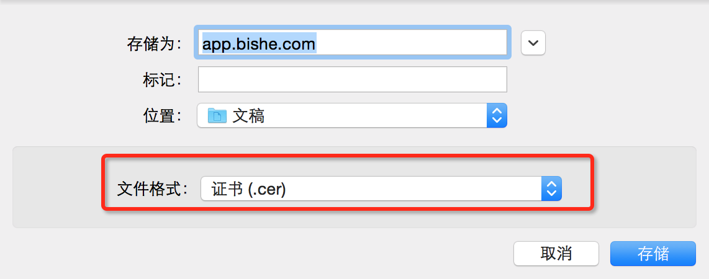
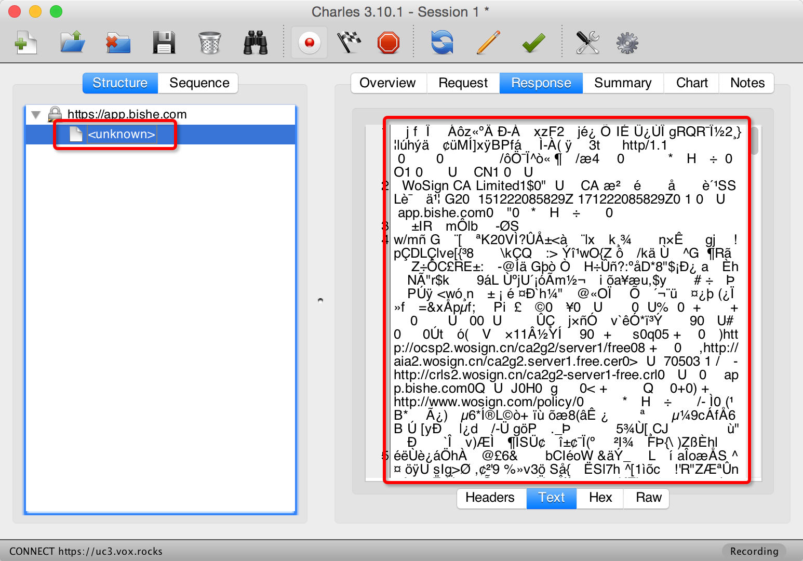

AFNetWorking中https的SSL认证
====

一般来讲如果app用了web service , 我们需要防止数据嗅探来保证数据安全.通常的做法是用ssl来连接以防止数据抓包和嗅探

其实这么做的话还是不够的 。 我们还需要防止中间人攻击（不明白的自己去百度）。攻击者通过伪造的ssl证书使app连接到了伪装的假冒的服务器上，这是个严重的问题！那么如何防止中间人攻击呢？

首先web服务器必须提供一个ssl证书，需要一个 .crt 文件，然后设置app只能连接有效ssl证书的服务器。

在开始写代码前，先要把 .crt 文件转成 .cer 文件，然后在加到xcode 里面

 .crt 文件转成 .cer 文件

1.使用openssl 进行转换


```
openssl x509 -in 你的证书.crt -out 你的证书.cer -outform der
```

2.通过安装crt文件，电脑导出

1）先打开“钥匙串访问”

2）选中你安装的crt文件证书，选择“文件”--》“导出项目”

3）选择.cer证书，存储即可。





#AFNetworking 对数据进行https ssl加密

实际上，很简单，只需要两步。

第一步：新增一个类

```

+ (AFSecurityPolicy*)customSecurityPolicy
{
    // /先导入证书
    NSString *cerPath = [[NSBundle mainBundle] pathForResource:@"hgcang" ofType:@"cer"];//证书的路径
    NSData *certData = [NSData dataWithContentsOfFile:cerPath];
    
    // AFSSLPinningModeCertificate 使用证书验证模式
    AFSecurityPolicy *securityPolicy = [AFSecurityPolicy policyWithPinningMode:AFSSLPinningModeCertificate];
    
    // allowInvalidCertificates 是否允许无效证书（也就是自建的证书），默认为NO
    // 如果是需要验证自建证书，需要设置为YES
    securityPolicy.allowInvalidCertificates = YES;
    
    //validatesDomainName 是否需要验证域名，默认为YES；
    //假如证书的域名与你请求的域名不一致，需把该项设置为NO；如设成NO的话，即服务器使用其他可信任机构颁发的证书，也可以建立连接，这个非常危险，建议打开。
    //置为NO，主要用于这种情况：客户端请求的是子域名，而证书上的是另外一个域名。因为SSL证书上的域名是独立的，假如证书上注册的域名是www.google.com，那么mail.google.com是无法验证通过的；当然，有钱可以注册通配符的域名*.google.com，但这个还是比较贵的。
    //如置为NO，建议自己添加对应域名的校验逻辑。
    securityPolicy.validatesDomainName = NO;
    
    securityPolicy.pinnedCertificates = @[certData];
    
    return securityPolicy;
}
```


第二步：直接在请求方法里加入，只有一行代码

```

+ (void)post:(NSString *)url params:(NSDictionary *)params success:(void (^)(id))success failure:(void (^)(NSError *))failure
{
    // 1.获得请求管理者
    AFHTTPRequestOperationManager *mgr = [AFHTTPRequestOperationManager manager];
    // 2.申明返回的结果是text/html类型
    mgr.responseSerializer = [AFHTTPResponseSerializer serializer];
    
    // 加上这行代码，https ssl 验证。
    //[mgr setSecurityPolicy:[self customSecurityPolicy]];
    
    // 3.发送POST请求
    [mgr POST:url parameters:params
      success:^(AFHTTPRequestOperation *operation, id responseObj) {
          if (success) {
              success(responseObj);
          }
      } failure:^(AFHTTPRequestOperation *operation, NSError *error) {
          if (failure) {
              failure(error);
          }
      }];
}
```

接下来，我们通过Charles抓取数据，抓到的数据已经加密。



可能遇到的问题

1）证书一定要拉到项目里面，AFN加了验证之后，看看获取证书的certData是否为空。如果为空，则证书有问题

```
NSData *certData = [NSData dataWithContentsOfFile:cerPath];
```

2.如果https服务器没有数据返回，很大可能是因为服务器配置出了问题。

 