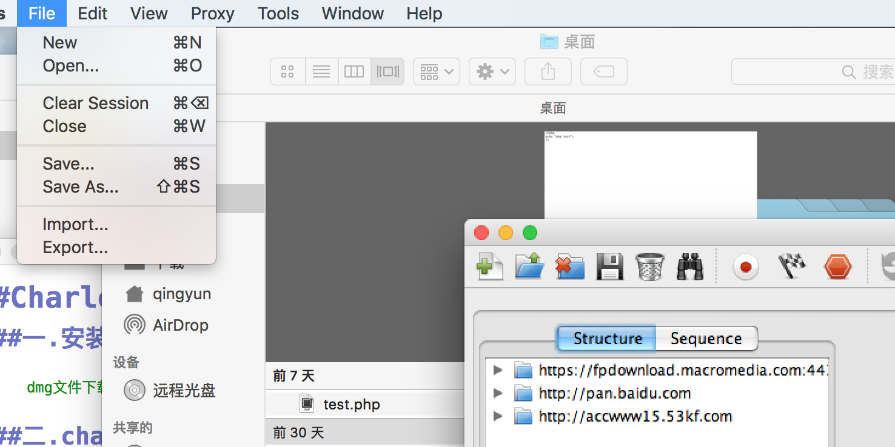
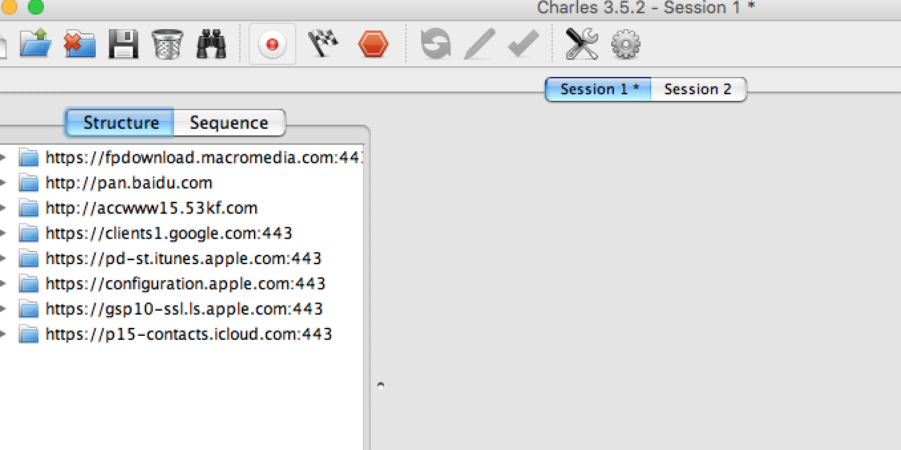
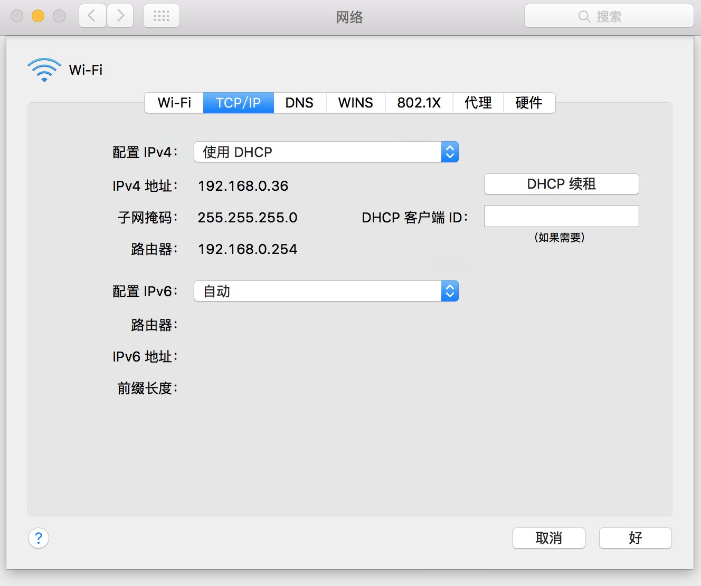
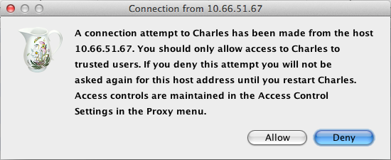
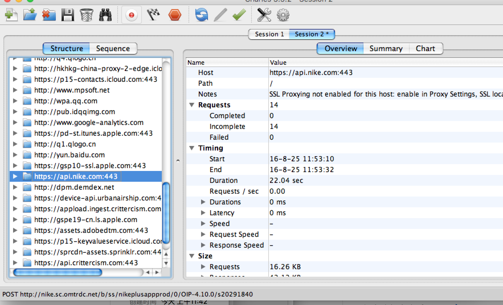

#Charles的使用
作者:高松
##一.安装charles

	dmg文件下载链接: http://pan.baidu.com/s/1qXHVGJU 密码: kcpg
	
##二.charles在mac上的简单使用

 charle在电脑的简单使用:
 
  1. 单击charles File菜单中的New按钮，新建一界面，如图:		
	
  2.单击界面中的启动/停止按钮，即红色圆点，即可监听到在此所有http与https地址的所有数据
  
     
     
     
##三.charles在iphone手机上的使用
  charles 在手机上抓包分两种 http 和https
  步骤如下：
  
#####HTTP抓包步骤:
  
   1. 打开Charles程序
   2. 查看Mac电脑的IP地址，如192.168.1.7
	
	
	
   3. 打开iOS设置，进入当前wifi连接，设置HTTP代理Group，将服务器填为上一步中获得的IP，即192.168.1.7，端口填8888
     
	4. iOS设备打开你要抓包的app进行网络操作
		
	5. Charles弹出确认框，点击Allow按钮即可
    	
    6.抓包如下:
        
####HTTPS抓包与http抓包的不同

1. 下载Charles证书http://www.charlesproxy.com/ssl.zip，解压后导入到iOS设备中（将crt文件作为邮件附件发给自己，再在iOS设备中点击附件即可安装；上传至百度网盘，通过safari下载安装）
2. 在Charles的工具栏上点击设置按钮，选择Proxy Settings…
3. 切换到SSL选项卡，选中Enable SSL Proxying，别急，选完先别关掉，还有下一步
4. 这一步跟Fiddler不同，Fiddler安装证书后就可以抓HTTPS网址的包了，Charles则麻烦一些，需要在上一步的SSL选项卡的Locations表单填写要抓包的域名和端口，点击Add按钮，在弹出的表单中Host填写域名，比如填api.instagram.com，Port填443

	