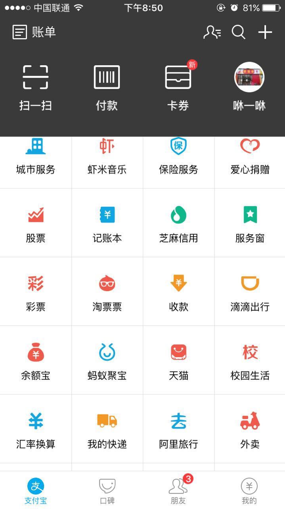
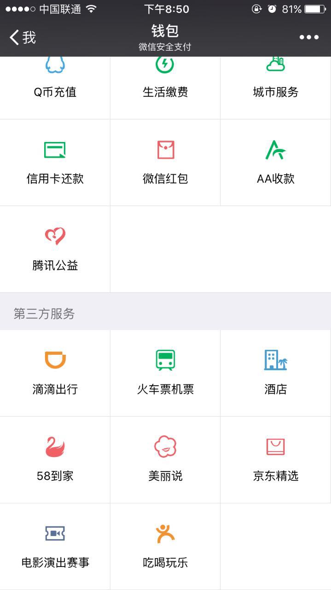
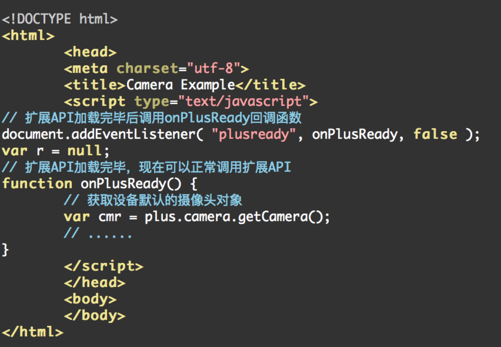
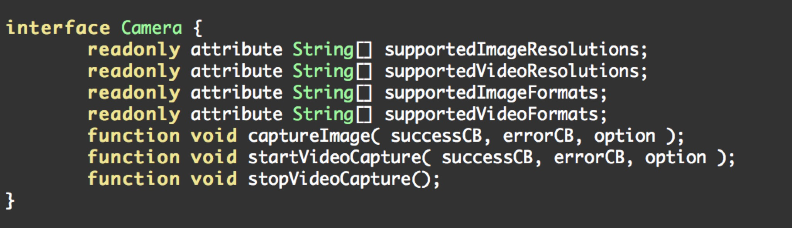
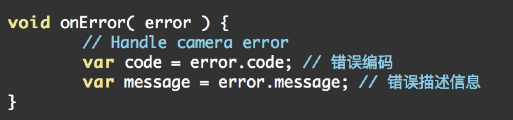
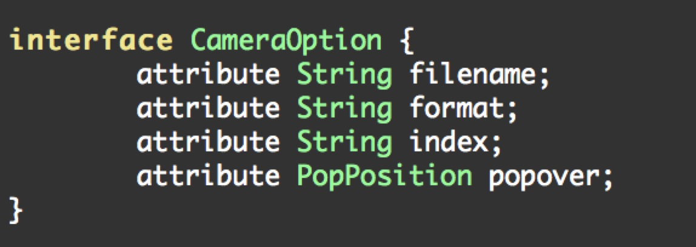

#HTML5+

## HTML5+是什么

&emsp;&emsp;&emsp;&emsp;&emsp;&emsp; HTML5+，全称为HTML5plus Runtime，是运行于手机端的强化web引擎，开发团队将原声的API接口用js封装，是的开发者可以通过调用js API从而达到调用原生借口的效果。从而解决webAPP的各种白屏，卡顿带来的先天劣势。
   
 &emsp;&emsp;&emsp;&emsp;&emsp;&emsp;之前国内外有类似的phonrGap／Cordova等框架，但是支持的js API太少，相比之下，H5+从以下三个方面解决了这个难题。
   
  - 将常用的二维码扫描，语音输入，地图，支付，文件系统，通讯录，时间，等常用Native API封装成公开的js API。
  - 使用一种可以将原生API映射为js API的技术。称之为Native.js 。语法是js语法，API命名是原生命名。
  - 支持5+ SDK ，把5+ Runtime作为一个SDK放入其他原生APP中。使用5+ SDK可以代替原来的创建webView这种低性能的做法。这种方式也叫做自定义5+插件。
  
       ex：我们的手机里并没有安装滴滴打车，但却可以在微信钱包，或者支付宝的第三方平台中使用滴滴打车功能。
       
       
       
       
##二 HTML5+的适用场景
   
&emsp;&emsp;&emsp;&emsp;&emsp;&emsp;曾经在之前的一家公司开发一款商城APP，笔者负责iOS端的开发工作。结果项目进行的四分之一了，老板要求最好能同时推出安卓版本，和微信H5页面。。。。。
         
我选择死亡。。。。

&emsp;&emsp;&emsp;&emsp;&emsp;&emsp;后来为了在三个平台上同步发布，笔者只能尝试使用webAPP的方式来开发。（别问我团队里为什么没有安卓和前端。。。）

&emsp;&emsp;&emsp;&emsp;&emsp;&emsp;但是直接内置webView的方式对于频繁刷新信息的商城类APP来说，带来的白屏，且品，卡顿，几乎是无法忍受的，而且webView几乎没有转场动画可言，所谓的页面跳转也就全是，刷新，读条，等待。。。。
       
&emsp;&emsp;&emsp;&emsp;&emsp;&emsp;后来比较了同类型的国外框架jQueryMobile，phoneGap，与国内的AppCan，apiClould之后，还是选择了可操作性更大，相对官方文档更为齐全的mui框架（内置H5+Runtime）来实现项目。

### 范例－调用摄像头

我们在官方文档中找到H5+提供的分装好的js API 
首先 通过 getCamera方法获得所要调用的摄像头

这里的index参数接受number对象，是一个可选参数，用来选择调用的摄像头索引值，1表示主摄像头，后置，2表示副摄像头，前置。这个方法给我们返回一个Camera对象。以供我们操作以下提供范例：

关于摄像头对象H5+给我们提供了四个封装好的属性和三个函数

四个readonly的属性，string[]表示该属性为字符串数组，分别为`摄像头支持的拍照分辨率，摄像分辨率，拍照文件格式，摄像文件格式`

三个函数，顾名思义（英文不好的同学面壁三分钟）

1. 进行拍照操作
2. 开始视频录制
3. 结束设想录制

我们来分析一下这三个函数。前两个函数共同的特点是接受相同的三个形参。这三个参数是两个回调函数以及一个参数对象。两个回调函数分别对应调用摄像头对象成功与失败（因为摄像头资源为独占资源，如果其他程序占用了摄像头，则此次操作失败。类似于听筒，扩音器这两种设备）。

我们可以看一下这两个回调函数

我们看到，这两个回调函数接受的参数都是两个字符串，captureFile代表照片的存储位置。如果失败的话，我们会得到两个错误变量，这两个错误变量都是error对象的两个属性。

那我们回过头再来看一看option参数

这个Json对象有四个属性分别代表

- 拍摄文件的保存路径
- 拍摄文件的格式
- 实用的摄像头索引值
- 以及弹出的摄像界面区域位置坐标

好了，至此，我们终于能够在手机的web页面中调用本地的摄像头，来进行拍照或者摄像，或者二维码的扫描。可以想象，就是将这一个个的基本Native应用通过H5+的方式来调用，从而使笔者完成了那个webApp的开发。当然，关于摄像头调用中还有很多其他函数和参数，有机会的话，笔者将会在后面的文章中为大家介绍。

