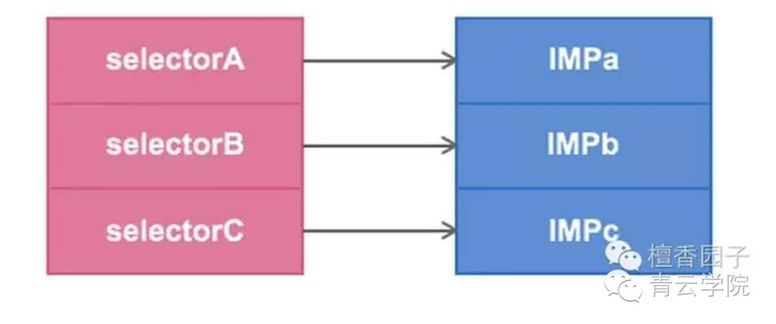
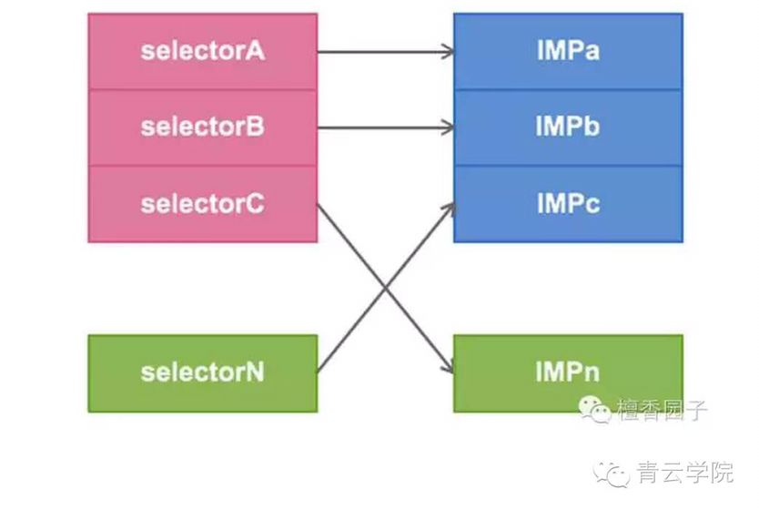

#Method Swizzling

作者：[王宇腾](https://github.com/)

Runtime运行时库是OC这门动态语言能够动起来的基石。通过灵活运用RunTime，我们能实现很多炫酷的功能。比如我们今天要向大家展示的method swizzling（方法交换）

* 例如在不知道一个类的源码的情况下，想要改变一个方法的实现，可以不通过继承或者类别

### Method Swizzling原理
* OC的方法调用会在底层转化为向该对象发送消息。这由C语言函数完成。是通过查找接收消息对象的方法列表，从方法列表中查找到对应的SEL，这个SEL对应着一个IMP（可以理解为函数指针，一个IMP可以对应多个SEL），通过这个IMP找到对应的方法来调用

* 在每个类中都有一个Dispatch Table，这个Dispatch Table本质是将类中的SEL和IMP进行对应。而我们的Method Swizzling就是对这个table进行操作，让SEL对应另一个IMP

方便理解，贴原理图两张



交换后的对应关系如下


###不多说，我们在代码里来体现
```
-(void)test1{
    NSLog(@"1");
}

-(void)test2{
    NSLog(@"2");
}

```
首先 我们在一个类当中生命并实现两个test方法。
之后，在实现一个叫做exchangeInstanceMethod的方法

```
-(void)exchangeInstanceMethod{
    
    Method m1 = class_getInstanceMethod([self class], @selector(test1));
    
    Method m2 = class_getInstanceMethod([self class], @selector(test2));
    
    method_exchangeImplementations(m1, m2);
    
    [self test1];
    
    [self test2];
    
    
    
}
```
Method是一个结构体，我们想要的IMP就在里面，看看结构

```
 struct objc_method {
    SEL method_name      OBJC2_UNAVAILABLE;                                             
    char *method_types   OBJC2_UNAVAILABLE;                                    
    IMP method_imp       OBJC2_UNAVAILABLE;                                    
}
```

我们通过运行时的函数获取到了两个方法的IMP指针，之后在将他们互相交换（exchangeImplementations）。
这样在调用这两个方法时，由于找到方法的IMP指针已被替换，自然会得到彼此实现的结果。

```
2016-06-17 16:58:47.560 demo[4920:344172] 2
2016-06-17 16:58:47.560 demo[4920:344172] 1
```

当然能够在程序中使用运行时代码，必须首先导入运行时头文件。。。。。。

（有的盆友get了半天都get不出来）。可以在opensource.apple上下载最新的运行时库源代码。

